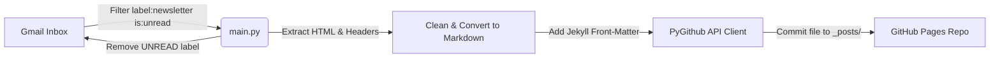

# 📬 Gmail Newsletter to GitHub Pages Pipeline

An automated, containerized pipeline that fetches unread newsletter emails from your Gmail inbox, converts them into Markdown files with Jekyll-compatible YAML front-matter, publishes them to a GitHub repository for GitHub Pages, and marks the emails as read.

---

## 🏗️ Architecture & Workflow



---

## 📁 Repository Structure

```
├── agent_instructions_newsletter_pipeline.md  # Original pipeline requirements specification
├── auth_setup.py                              # One-time local OAuth2 authentication helper
├── main.py                                    # Core pipeline script & schedule loop
├── requirements.txt                           # Python package dependencies
├── Dockerfile                                 # Docker configuration for continuous deployment
├── .env.example                               # Environment variables template
└── .gitignore                                 # Git ignore configuration
```

---

## ⚙️ Prerequisites & Initial Setup

### 1. Google Cloud Console (Gmail API Credentials)
1. Navigate to the [Google Cloud Console](https://console.cloud.google.com/).
2. Create a new project (e.g., `Newsletter-Pipeline`).
3. Enable the **Gmail API** under **APIs & Services > Library**.
4. Go to **APIs & Services > Credentials** and click **Create Credentials > OAuth client ID**.
5. Choose **Application type:** `Desktop app`.
6. Download the JSON credentials file and save it as `credentials.json` in the project root directory.

### 2. Gmail Filter Setup
Create a filter in your Gmail account:
- Search query: `from:newsletter@domain.com` (or matching your preferred newsletters).
- Action: Apply label `newsletter`.

### 3. GitHub Personal Access Token (PAT)
1. Go to your GitHub account **Settings > Developer Settings > Personal Access Tokens > Tokens (classic)**.
2. Generate a new token with the `repo` scope.
3. Save the token securely.

---

## 🔐 One-Time OAuth Authentication (`auth_setup.py`)

Before deploying headlessly in Docker, run the setup script locally to authenticate with Google:

```bash
# Install local dependencies
pip install -r requirements.txt

# Run auth setup
python auth_setup.py
```

- A browser window will open asking for permissions to manage Gmail.
- After authorizing, `token.json` will be saved in your project root.
- ⚠️ **Keep `credentials.json` and `token.json` secret. Do not commit them to version control.**

---

## 🚀 Environment Configuration

Create a `.env` file based on `.env.example`:

```bash
cp .env.example .env
```

Edit `.env` with your values:
```env
GITHUB_TOKEN=ghp_your_actual_personal_access_token
GITHUB_REPO=username/daily-newsletters
FETCH_INTERVAL_HOURS=4
POSTS_DIR=_posts
```

---

## 🐳 Running with Docker

### Build Docker Image
```bash
docker build -t gmail-newsletter-pipeline .
```

### Run Docker Container
Mount `credentials.json`, `token.json`, and pass environment variables:

```bash
docker run -d \
  --name newsletter-pipeline \
  --restart unless-stopped \
  --env-file .env \
  -v "$(pwd)/credentials.json:/app/credentials.json" \
  -v "$(pwd)/token.json:/app/token.json" \
  gmail-newsletter-pipeline
```

### View Live Logs
```bash
docker logs -f newsletter-pipeline
```

---

## 🧪 Local Execution (Without Docker)

You can also run the pipeline directly on your system:

```bash
python main.py
```

The script runs immediately on startup and schedules checks every `FETCH_INTERVAL_HOURS` hours.
